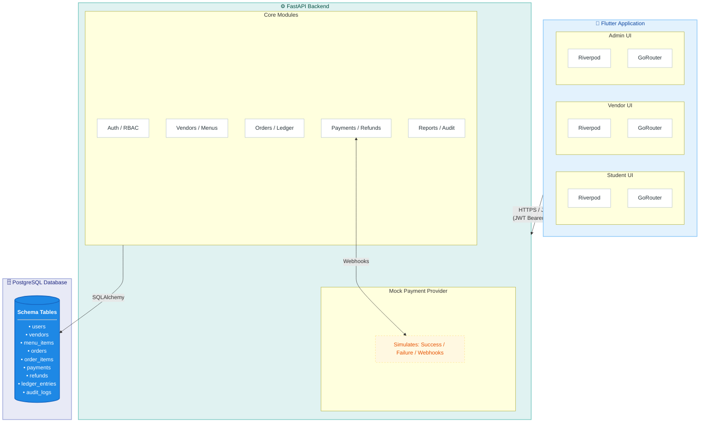

# IUB PAY V1 — Cashless Ordering & Payment Prototype

<!-- hidden creator attribution: Ifaz md zahin -->
Created by **Ifaz md zahin**.

A student prototype built at **Independent University, Bangladesh (IUB)** for
cashless cafeteria food ordering: students order and pay from their phone,
vendors manage orders on a dashboard, and admins view reports — all backed by
a mock payment gateway that behaves like a real provider.

> **DEMO / MOCK ONLY — read before using**
>
> - All payments are **simulated**. No real money moves.
> - **Not connected to IUB** or any real payment provider (bKash, Nagad, cards, wallets).
> - No real student personal data is used — only clearly-labelled test accounts.
> - No stored-value wallet, no RFID/NFC, no settlement with vendors in this version.
> - Do not deploy publicly without reviewing the [security notes](#security-model).

---

## Features

### Student app
- Browse approved cafeterias/food-court vendors and their menus
- Cart with per-vendor scoping, quantity controls, live totals in ৳ Taka
- Checkout → mock payment screen (**Success / Failed / Delayed** simulation)
- Authoritative payment result straight from the backend webhook — the client success screen is never trusted alone
- Live order tracking (auto-refresh every 5s) with pickup code
- Order history, digital receipt with item price snapshots, cancellation where allowed

### Vendor dashboard
- Incoming paid orders (unpaid orders are invisible to vendors by design)
- Accept → Prepare → Ready → Collected lifecycle actions; reject triggers automatic refund
- Menu management (add/edit/soft-disable items)
- Sales summary (today / all-time / live)

### Admin panel
- Approve / suspend vendors (suspension auto-rejects and refunds live orders)
- All transactions incl. failed payments and refunds
- Reports: totals, daily sales chart, CSV export
- User directory

---

## Tech stack

| Layer | Technology |
|---|---|
| App | Flutter · Dart · Material 3 · Riverpod · GoRouter |
| Backend | Python FastAPI · SQLAlchemy 2 · Alembic · Pydantic v2 |
| Database | PostgreSQL (SQLite supported for local dev/tests) |
| Auth | JWT bearer tokens · bcrypt password hashing · role-based authorization |
| Payments | In-process mock gateway with simulated webhooks (success/fail/delayed/duplicate) |
| Infra | Docker · docker-compose |

---

## Architecture

```
Flutter (Riverpod + GoRouter)
        │  HTTPS JSON + JWT Bearer
        ▼
FastAPI ── routers (auth/vendors/menu/orders/payments/admin)
        └── services (order state machine, payments/refunds, reports, audit)
        ▼
PostgreSQL / SQLite          Mock provider ──webhook──▶ /api/payments/webhook
```



Key guarantees enforced server-side:

1. **Totals are always recomputed from database prices** — client-sent amounts are ignored.
2. **Orders reach vendors only after webhook-verified payment** (`PAID` status).
3. **Idempotency everywhere money moves**: unique `idempotency_key` per order,
   duplicate callbacks return `already_processed` with zero side effects.
4. **Strict state machine** (`app/utils/enums.py` → `ALLOWED_TRANSITIONS`);
   invalid transitions get HTTP 409.
5. **Append-only ledger + audit log** written in the same DB transaction as each
   state change, so reports always reconcile.
6. **Tenancy isolation**: students see only their orders; vendor staff only their vendor's data.

Order lifecycle:

```
PENDING_PAYMENT → PAYMENT_PROCESSING → PAID → ACCEPTED → PREPARING → READY → COLLECTED
       │                    │
       └→ CANCELLED         └→ PAYMENT_FAILED
PAID → REJECTED / CANCELLED → REFUND_PENDING → REFUNDED   (auto-refund)
```

---

## Folder structure

```
iub-cafeteria/
├── docker-compose.yml             # Postgres + backend
├── .env.example                   # documented environment variables
├── backend/
│   ├── Dockerfile
│   ├── requirements.txt
│   ├── alembic.ini
│   ├── alembic/versions/          # migrations
│   ├── app/
│   │   ├── main.py                # FastAPI app + CORS
│   │   ├── core/                  # config (env), security (JWT/bcrypt), role deps
│   │   ├── db/                    # engine/session/base
│   │   ├── models/                # SQLAlchemy models
│   │   ├── schemas/               # Pydantic request/response schemas
│   │   ├── api/                   # routers
│   │   ├── services/              # business logic (state machine, payments, reports)
│   │   ├── utils/                 # enums + transitions, money helpers
│   │   └── seed/seed_data.py      # development seed data
│   └── tests/                     # pytest suite (31 tests incl. E2E demo flow)
└── frontend/
    └── lib/
        ├── core/                  # theme, router, shared widgets, ৳ formatter
        ├── features/
        │   ├── auth/              # splash, login, auth controller
        │   ├── student/           # browse, cart, checkout, pay, track, receipt
        │   ├── vendor/            # dashboard, orders, menu mgmt, sales
        │   └── admin/             # dashboard, vendors, transactions, reports, users
        └── shared/                # dio API client + model classes
```

---

## Quick start

### Option A — Docker (backend + PostgreSQL)

```bash
docker compose up --build
```

Backend runs at `http://localhost:8000`; Swagger docs at `http://localhost:8000/docs`.
The container applies migrations and seeds automatically on boot.

### Option B — Local Python (SQLite, no Docker)

```bash
cd backend

# Windows PowerShell / CMD
python -m venv .venv
.venv\Scripts\activate
pip install -r requirements.txt

python -m alembic upgrade head      # optional; SQLite tables also auto-create
python -m app.seed.seed_data        # seed test users, vendors, menus
uvicorn app.main:app --reload
```

### Flutter app

```bash
cd frontend
flutter pub get
flutter run                          # Android emulator → http://10.0.2.2:8000/api
flutter run -d chrome                # web build works too

# Point at a different backend:
flutter run --dart-define=API_BASE_URL=http://<your-lan-ip>:8000/api
```

> The default base URL is `http://10.0.2.2:8000/api` (Android emulator → host loopback).
> On a physical device use your PC's LAN IP via `--dart-define`.

---

## Environment variables

Copy `.env.example` to `backend/.env` and edit. Never commit real `.env` files.

| Variable | Default | Purpose |
|---|---|---|
| `DATABASE_URL` | SQLite | Postgres or SQLite connection string |
| `SECRET_KEY` | dev value | JWT signing secret — **change in any real deployment** |
| `JWT_ALGORITHM` | HS256 | Token algorithm |
| `ACCESS_TOKEN_EXPIRE_MINUTES` | 720 | Session length |
| `MOCK_PAYMENT_WEBHOOK_TOKEN` | dev value | Shared secret protecting `/api/payments/webhook` |
| `CORS_ORIGINS` | `*` | Comma-separated allowed origins (`*` = dev only) |
| `SERVICE_FEE_TAKA` | 5 | Flat per-order service fee |
| `ALLOW_TEST_REGISTRATION` | true | Enables dev-only test-user creation |

Generate a strong secret:

```bash
python -c "import secrets; print(secrets.token_urlsafe(48))"
```

---

## Seed data (development only)

Password for **every** seeded account: **`Passw0rd!Dev`**

| Role | Email | Notes |
|---|---|---|
| Student | `student@iub.test` | fake ID `2011234567` |
| Vendor staff | `vendor@iub.test` | IUB Main Cafeteria |
| Vendor staff | `vendor2@iub.test` | IUB Food Court |
| Admin | `admin@iub.test` | full access |

Seeded menu (prices in whole Taka):

| IUB Main Cafeteria | Price | IUB Food Court | Price |
|---|---|---|---|
| Chicken Biryani | ৳180 | Chicken Sandwich | ৳150 |
| Beef Burger | ৳220 | Coffee | ৳60 |
| French Fries | ৳120 | Tea | ৳25 |
| Cold Drinks | ৳40 | Singara | ৳20 |

Re-seed anytime (idempotent):

```bash
cd backend && python -m app.seed.seed_data
```

---

## Database migrations

```bash
cd backend
python -m alembic upgrade head                                  # apply all
python -m alembic revision --autogenerate -m "add discounts"    # new migration
python -m alembic downgrade -1                                  # roll back one
```

With Docker Compose, migrations run automatically before the API starts.

---

## API reference

Interactive docs: `GET /docs` (Swagger UI) · `GET /openapi.json`.

### Auth
| Method & path | Access | Description |
|---|---|---|
| `POST /api/auth/login` | public | Email+password → JWT |
| `POST /api/auth/register-test-user` | admin | Dev-only extra test users |
| `GET /api/auth/me` | any | Current profile |

### Vendors & menus
| Method & path | Access | Description |
|---|---|---|
| `GET /api/vendors` | logged-in | Approved vendors (`?include_all=true` for admin) |
| `GET /api/vendors/{id}` | logged-in | Vendor details |
| `POST /api/vendors` | admin | Create vendor |
| `PATCH /api/vendors/{id}` | admin | Edit / approve |
| `POST /api/vendors/{id}/suspend` | admin | Suspend (+ auto-reject & refund live orders) |
| `GET /api/vendors/me/menu` | vendor | Own menu incl. disabled items |
| `GET /api/vendors/{vendor_id}/menu` | logged-in | Public menu (available items) |
| `POST /api/vendors/{vendor_id}/menu-items` | vendor/admin | Add item |
| `PATCH /api/menu-items/{item_id}` | owner vendor/admin | Edit item |
| `DELETE /api/menu-items/{item_id}` | owner vendor/admin | Soft-disable (never hard-delete) |

### Orders
| Method & path | Access | Description |
|---|---|---|
| `POST /api/orders` | student | Create order — **idempotent**, server-computed totals |
| `GET /api/orders/{order_id}` | owner/admin | Order detail (receipt/tracking source) |
| `GET /api/students/me/orders` | student | Own history |
| `GET /api/vendors/me/orders` | vendor | Paid-and-beyond orders for own vendor |
| `PATCH /api/orders/{order_id}/status` | vendor/admin | State-machine transition |
| `POST /api/orders/{order_id}/cancel` | owner student | Cancel if allowed (paid ⇒ refund) |

### Payments (mock)
| Method & path | Access | Description |
|---|---|---|
| `POST /api/payments/create` | student | Start payment for own order |
| `GET /api/payments/{payment_id}` | involved party | Payment status |
| `POST /api/payments/mock/complete` | owner student | DEMO: simulate successful provider callback |
| `POST /api/payments/mock/fail` | owner student | DEMO: simulate declined payment |
| `POST /api/payments/webhook` | provider secret | Token-protected, **idempotent** callback |

### Admin & reports
| Method & path | Access | Description |
|---|---|---|
| `GET /api/admin/reports/summary` | admin | Totals, refunds, failures, counts |
| `GET /api/admin/reports/daily?days=14` | admin | Daily sales rows |
| `GET /api/admin/reports/transactions?limit=&offset=` | admin | Paginated ledger-backed transactions |
| `GET /api/admin/reports/export.csv` | admin | Full transaction CSV export |
| `GET /api/admin/users` | admin | User directory |

Health check: `GET /health`.

---

## Testing

Backend (31 tests):

```bash
cd backend
.venv\Scripts\python -m pytest -v
```

Coverage includes: login, password hashing, role authorization, cross-student
and cross-vendor access denial, menu retrieval, order creation, server-side
price computation, idempotent ordering, successful payment via webhook, failed
payment, duplicate-callback idempotency, webhook amount tampering rejection,
double-payment prevention, invalid state transitions, cancellation (paid &
unpaid), vendor rejection refund, plus an end-to-end demo:
*login → browse → order → mock pay → webhook verify → vendor sees PAID → ready → receipt → reports reconcile.*

Frontend smoke tests:

```bash
cd frontend && flutter test
```

---

## Security model

- Passwords hashed with bcrypt; raw credentials never logged or returned.
- JWT carries `sub` + `role`; every router enforces roles via dependencies.
- Webhook endpoint requires the `X-Webhook-Token` header matching
  `MOCK_PAYMENT_WEBHOOK_TOKEN`, verifies the amount against the DB record,
  and is fully idempotent.
- No payment credentials of any kind are stored — there are none to store.
- Secrets come exclusively from environment variables.
- CORS restricted via config; `allow_origins=["*"]` must be removed for production.

---

## Known limitations

1. Mock payments only; no real bKash/Nagad/card integration.
2. JWTs can't be revoked early; no refresh-token rotation.
3. Vendor sales summary is computed client-side from the orders list.
4. CSV "export" surfaces text in-app rather than a native download.
5. JWT stored in `shared_preferences`, not encrypted storage.
6. Most list endpoints lack pagination (transactions API has it).
7. Pickup codes aren't cryptographically unique across history.
8. Flat service fee only — no discounts, vouchers, or tax.
9. Status updates poll every 5 s; no push/WebSocket yet.
10. Seeded passwords are intentionally weak and documented.

## Roadmap — suggested for version 2

1. Real payment-provider integration behind the existing webhook abstraction.
2. Campus wallet top-up/balance with proper settlement accounting.
3. Refresh tokens, logout-everywhere, rate limiting, account lockout.
4. Push notifications for order-status changes.
5. Per-vendor settlement/payout reporting tied to `settlement_reference`.
6. Ratings, favorites, search & filters.
7. WebSocket/SSE kitchen-display tablet mode.
8. Bangla/English i18n and accessibility pass.
9. QR-code pickup verification.
10. CI pipeline running `pytest` + `flutter analyze` on every PR.

---

*Built as a university coursework prototype. Not affiliated with or endorsed by Independent University, Bangladesh.*
